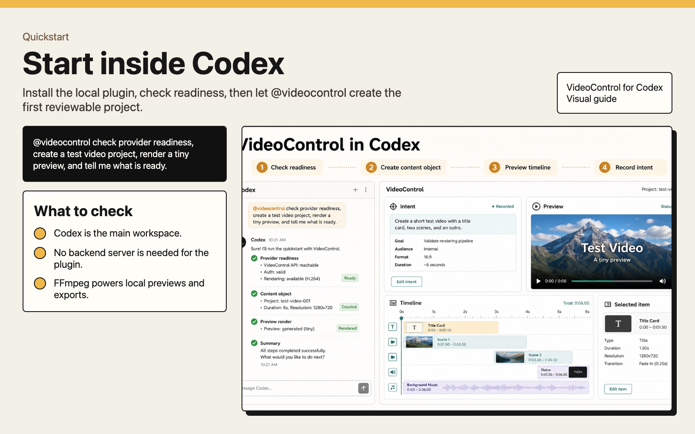

# VideoControl for Codex

VideoControl helps Codex plan, make, review, and package video ads and social content.

It keeps each piece of work in a local project folder, so the brief, script, source media, generated assets, timeline, previews, final renders, handoff notes, and feedback stay together.

Use it when you want Codex to turn an idea into a previewable video, ad variant, social post, or campaign package without losing the decisions that led to the final result.

## Install from a Cloned Repo

Codex does not yet have a self-publishing path for this plugin. Until that exists, another person can install VideoControl by cloning this repo and adding it to Codex as a local plugin.

### 1. Get the Code

```bash
git clone <VIDEOCONTROL_REPO_URL> videocontrol
cd videocontrol
```

Replace `<VIDEOCONTROL_REPO_URL>` with the real repo URL.

### 2. Install and Build

```bash
corepack enable
pnpm install
pnpm build
```

VideoControl needs Node.js, pnpm, FFmpeg, and ffprobe. The readiness check below will tell you if anything is missing.

### 3. Prepare the Local Plugin

```bash
pnpm plugin:local
pnpm check:prereqs
```

This prepares the local plugin files and writes the local marketplace entry that Codex can read.

If the readiness check says Codex still cannot see the marketplace, run this from inside the cloned repo:

```bash
codex plugin marketplace add "$(pwd)"
```

### 4. Install in Codex

1. Restart Codex.
2. Open Plugins.
3. Choose the **VideoControl Local** marketplace.
4. Install **VideoControl for Codex**.
5. Start a new thread and use `@videocontrol`.

Try this first:

```text
@videocontrol check provider status, create a test video project, render a tiny preview, and tell me what is ready.
```

### 5. Check Readiness Later

```bash
pnpm videocontrol doctor
```

### Updating After Pulling Changes

After pulling new repo changes, refresh the installed local plugin copy:

```bash
pnpm install
pnpm build
pnpm plugin:local
```

Then restart Codex. Codex uses an installed local copy of the plugin, so repo changes are not picked up until the local plugin is refreshed.

## What It Is For

- Product demo ads
- Social video variants
- Founder, presenter, and UGC-style video workflows
- Timeline-based previews and final exports
- Ad-readiness and shareability checks
- Platform handoff packages for publishing and ads tools
- A reusable library of winning creative
- Owner-approved X social bot drafts and metrics

## How It Works

1. Create a VideoControl project.
2. Keep project intent in `.videocontrol/intent/` so later edits preserve the same direction.
3. Create a content object for the ad, post, video, campaign, or variant.
4. Write the brief, script, shot list, and asset plan.
5. Import local media or request generated assets from connected providers.
6. Assemble a timeline and preview cut.
7. Render variants locally when possible.
8. Check the work for ad readiness, shareability, voice, and platform fit.
9. Package approved output for Postiz, Meta, TikTok, YouTube Shorts, LinkedIn, X, or another handoff target.
10. Record performance notes so future work improves.

Codex does the workflow through `@videocontrol`. The local browser preview gives you a review console inside Codex for the project, brief, variants, verification results, provenance, handoff files, previews, and renders.

## What Works Locally Now

- Create local VideoControl projects.
- Create sample projects with tiny generated media for local testing.
- Store project intent and review targets so later work keeps the same creative direction.
- Import video, audio, and image assets.
- Inspect media with FFmpeg and ffprobe.
- Edit structured video timelines.
- Keep timeline versions.
- Validate timelines before rendering.
- Render preview ranges and contact sheets.
- Render final local exports.
- Create Content OS run folders for ads, social posts, campaigns, and variants.
- Create briefs, scripts, storyboards, shot lists, variant plans, scheduler handoffs, and library bundles.
- Score drafts for bookmarkability, avoid-slop issues, viral mechanics, and ad readiness.
- Track provenance, feedback, winners, and losers.
- Show a first-run provider readiness reminder for Codex.
- Save creative preferences such as provider, platform, aspect ratio, captions, pacing, and style notes.
- Prepare reference images or videos before provider generation.
- Improve rough asset prompts using project intent and saved preferences.
- Record long-running provider jobs so Codex can check and import results later.
- Register local ComfyUI workflows for local image generation.
- Show generated assets as selectable review items.
- Prepare owner-approved X social bot drafts and metrics through the official API path.

## First-Time Installer Notes

- You do not need to run a backend server for the plugin itself.
- Codex starts the local VideoControl tool process when it uses the plugin.
- FFmpeg and ffprobe are required for local previews, contact sheets, and renders.
- HeyGen, Higgsfield, Agent Media, Postiz, Meta, and X setup are optional. VideoControl still works locally without them.
- If a provider is missing, VideoControl should prepare the brief, timeline, and handoff, then tell you what setup is needed.
- Local plugin installs are cached by Codex. After changing this repo, run `pnpm plugin:local` and restart Codex.

The easiest full setup command is:

```bash
pnpm videocontrol setup
```

That command builds the local tools, writes the local plugin config, writes the repo marketplace entry, tries to register the marketplace with Codex, and prints the first prompt to try.

## What Files It Creates

VideoControl stores local project work under `.videocontrol/` inside each project.

Typical files include:

- project settings
- imported asset records
- timeline versions
- preview renders
- contact sheets
- final renders
- reference assets prepared for provider work
- provider job records
- content objects
- briefs, scripts, shot lists, and variant plans
- verification notes
- handoff files
- source records and feedback notes

Source media stays outside `.videocontrol/` unless you explicitly ask VideoControl to copy it.

Saved creative preferences live in `~/.videocontrol/preferences.json`. Provider secrets, when needed, live in `~/.videocontrol/secrets/providers.local.json`.

## First-Time Reviewer Notes

When reviewing VideoControl behavior, check that it:

- creates or opens a content object before serious creative work
- inspects media before editing
- avoids overwriting source files
- validates timelines after edits
- renders a preview before final export
- does not pretend missing providers generated assets
- keeps the brief, timeline, render, source record, verification, handoff, and feedback together
- packages for publishing or ads tools without publishing or launching without approval

## Provider Roles

| Provider | Current role |
| --- | --- |
| Local VideoControl | Working now: timelines, imports, FFmpeg previews, renders, contact sheets, provenance, and review console. |
| HeyGen | Avatar, presenter, and talking-head video generation when the HeyGen app or CLI is available. |
| Higgsfield | Generated visuals, b-roll, marketing assets, image/video generation, and scoring when the CLI or MCP surface is available. |
| Agent Media | UGC-style actor videos, SaaS review videos, subtitles, actor browsing, and downloads when the `agent-media` CLI is available. |
| ComfyUI | Local workflow-based image generation when ComfyUI is running and a workflow is registered. |
| Postiz | Handoff target for scheduling approved social posts, media upload, integration discovery, and analytics when the CLI is available. |
| Meta MCP | Handoff target for ad launch, performance readback, and winner scaling. |
| X / Twitter | Social bot setup, owner-label verification, drafts, approval handoff, and metrics through the official API only. |

If a provider is not installed or signed in, VideoControl should say what is missing, write the intended handoff or provenance record, and stop before pretending it generated an asset.

## Best First Prompts

```text
@videocontrol check provider status, create a test video project, generate a tiny local preview, and tell me what is ready.
```

```text
@videocontrol create a content object for a 30-second product demo ad, write the brief, make a script, assemble a preview cut, and verify it.
```

```text
@videocontrol turn this product brief into three short video variants with hooks, captions, and platform handoff files.
```

```text
@videocontrol prepare an owner-approved X bot draft from this launch note and store metrics after publishing.
```

## Sample Projects

Create three small sample projects with generated media, previews, contact sheets, exports, and content folders:

```bash
pnpm create:samples
```

This creates:

- `samples/product-demo`
- `samples/ugc-ad`
- `samples/social-clip`

Use these when you want to confirm that local media inspection, timelines, preview rendering, exports, and content folders are working before connecting external providers.

## Visual Guide

Reusable screenshot-based guide images live in `docs/visual-guide/images/`.

Start with:



See the full set in `docs/visual-guide/README.md`.

## Project Intent and Review

Each VideoControl project can carry its creative direction forward through:

- `.videocontrol/intent/project-intent.json`
- `.videocontrol/intent/project-intent.md`
- `.videocontrol/review.json`

The intent files store direction such as visual style, caption rules, safe zones, target platforms, approval notes, and patterns to keep or avoid.

The review file gives the preview console stable selection ids for clips, captions, variants, generated assets, and handoffs. Agents should read it before making later changes so they can target the exact item under review.

Record a new review note with:

```bash
pnpm exec videocontrol intent update --project ./samples/product-demo --selection clip:c_source --note "Keep the opening direct and product-led."
```

In Codex, ask:

```text
@videocontrol update project intent from this review note: keep the first two seconds direct and product-led.
```

## Codex Generation Workflow

Codex is the main interface. Use `@videocontrol` first, and let the plugin keep the project state, review file, and content object records together.

When generated media is needed:

1. Check what is ready with `provider_readiness_reminder`.
2. Save durable direction with `update_creative_preferences` when the user gives repeatable style, platform, caption, or pacing guidance.
3. Prepare product shots, screenshots, logos, or previous ads with `prepare_reference_asset`.
4. Turn the rough request into a provider-ready prompt with `enhance_asset_prompt`.
5. Submit long-running work with `submit_creative_asset_job`.
6. Read the job with `get_creative_asset_job` instead of retrying blindly.
7. Import the finished or downloaded result with `import_creative_asset_job`.
8. Refresh `get_project_review` or `open_preview` so the generated asset appears as a selectable review item.

For local ComfyUI:

```bash
pnpm exec videocontrol provider comfyui import --name product-hero --workflow ./workflow.json
pnpm exec videocontrol provider submit --provider comfyui --workflow product-hero --kind image --prompt "Proof-led product hero image"
```

Hermes or other MCP hosts can be used for experiments, but the default workflow should still keep Codex, `.videocontrol/intent/project-intent.md`, `.videocontrol/review.json`, and content objects as the source of truth.

## Useful Commands

```bash
pnpm build
pnpm test
pnpm check:prereqs
pnpm create:samples
pnpm videocontrol doctor
pnpm videocontrol setup
pnpm exec videocontrol intent update --note "Keep this direction."
pnpm exec videocontrol provider readiness
pnpm exec videocontrol preferences update --provider higgsfield --platform meta-reels --aspect 9:16
pnpm exec videocontrol reference prepare --project ./samples/product-demo --input ./product-shot.png
pnpm exec videocontrol prompt enhance --project ./samples/product-demo --platform meta-reels --prompt "Product hero image"
pnpm exec videocontrol provider submit --project ./samples/product-demo --slug product-demo --provider higgsfield --kind image --prompt "Proof-led product hero"
pnpm exec videocontrol provider job --project ./samples/product-demo --job job_123
pnpm exec videocontrol provider import-job --project ./samples/product-demo --slug product-demo --job job_123 --asset ./generated.png
pnpm exec videocontrol provider comfyui import --name product-hero --workflow ./workflow.json
pnpm plugin:local
pnpm smoke
pnpm smoke:creative-os
pnpm smoke:social-bot
pnpm dev:preview
pnpm mcp
pnpm exec videocontrol help
```

## Provider Setup

Browser sign-in is the preferred setup path. The agent can open the provider's official sign-in page in the Codex browser and guide you while you complete login and consent.

Local secrets files are also supported for providers that need manual credentials. The default private file is:

```text
~/.videocontrol/secrets/providers.local.json
```

Create a private template or check provider setup with:

```bash
pnpm exec videocontrol provider auth secret-template --provider heygen
pnpm exec videocontrol provider auth oauth --provider higgsfield
pnpm exec videocontrol provider auth oauth --provider agent-media
pnpm exec videocontrol provider auth status
```

Secrets should never be stored in a VideoControl project, content object, handoff, provenance file, or library bundle.

## Review Console

Start the local review console with:

```bash
pnpm dev:preview
```

The console shows the current project, preview video, contact sheet, timeline version, content object state, brief status, variants, verification, source record, and handoff status. It is a review surface, not a full video editor.

## Social Bot Flow

VideoControl can prepare an owner-labeled X bot workflow without automating the X website. It creates the setup checklist, verifies the public label text you provide, writes official X API connection instructions, drafts posts, requires approval before publishing, and stores metrics locally.

```bash
pnpm exec videocontrol social-bot setup-checklist --bot @my_bot --owner @me
pnpm exec videocontrol social-bot verify-label --bio "Automated account managed by @me." --label "@my_bot is automated"
pnpm exec videocontrol social-bot connect-x --app "VideoControl Social Bot"
pnpm exec videocontrol social-bot draft --text "Post copy"
pnpm exec videocontrol social-bot approve <draft-id>
pnpm exec videocontrol social-bot publish <draft-id> --requires-approval
pnpm exec videocontrol social-bot metrics --tweet-id 123 --impressions 1000 --likes 25
```

## One-Page Explainer Copy

**Headline**

VideoControl for Codex

**Subheadline**

Make agent-created video ads and social posts without losing the brief, timeline, approvals, or results.

**Short Description**

VideoControl turns Codex into a local creative workspace for video ads and social content. It helps an agent move from brief to script, asset plan, timeline preview, render, verification, platform handoff, and feedback. Each ad, post, campaign, or variant gets its own content object, so the work can be reviewed, reused, and improved.

**What It Connects**

VideoControl works locally with FFmpeg and ffprobe, can route generation work to providers like HeyGen, Higgsfield, and Agent Media when they are available, and prepares handoff files for Postiz, Meta, X, TikTok, YouTube Shorts, LinkedIn, and other publishing or ads systems.

**Flow**

Brief -> Script -> Asset Plan -> Timeline Preview -> Render -> Verify -> Platform Handoff -> Feedback
