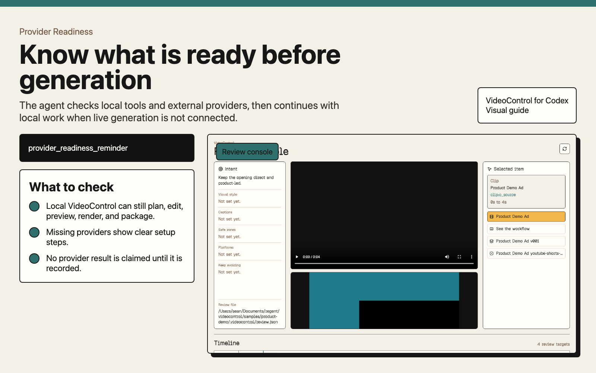
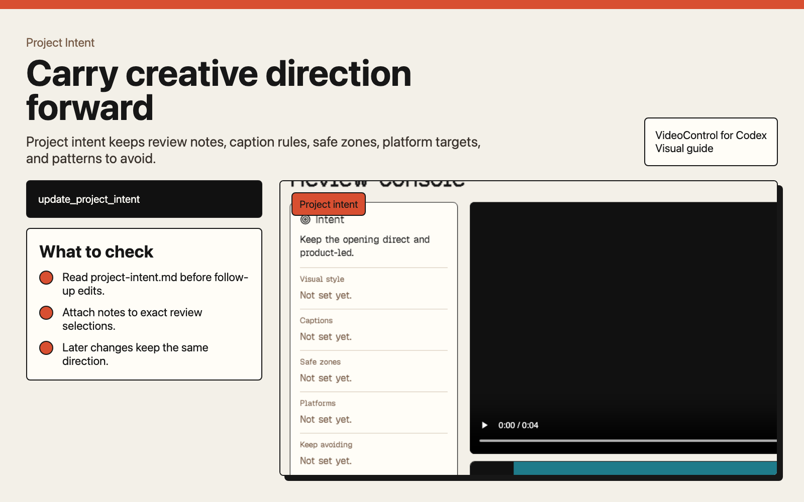
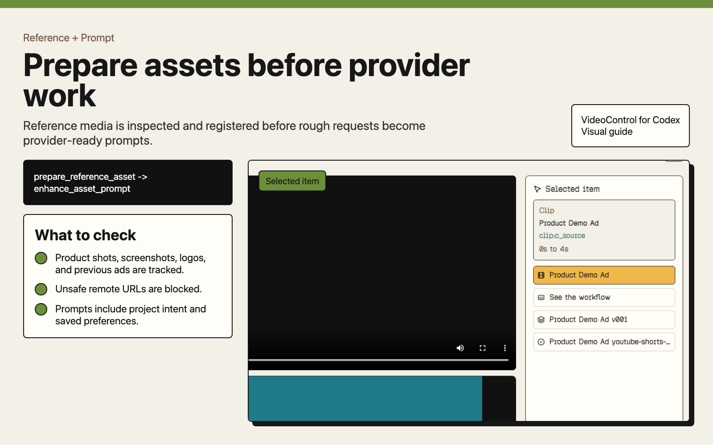
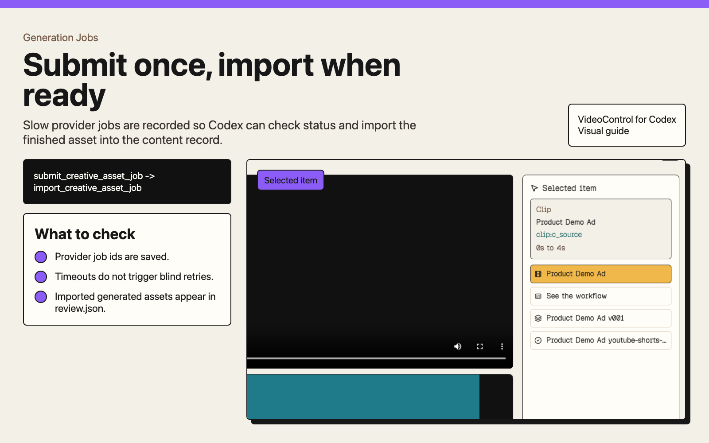
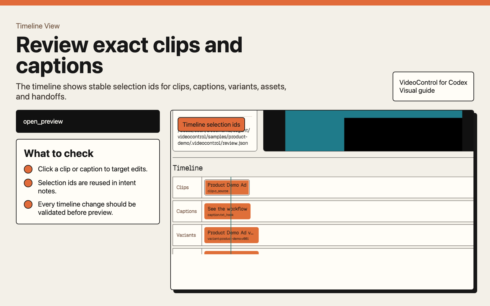
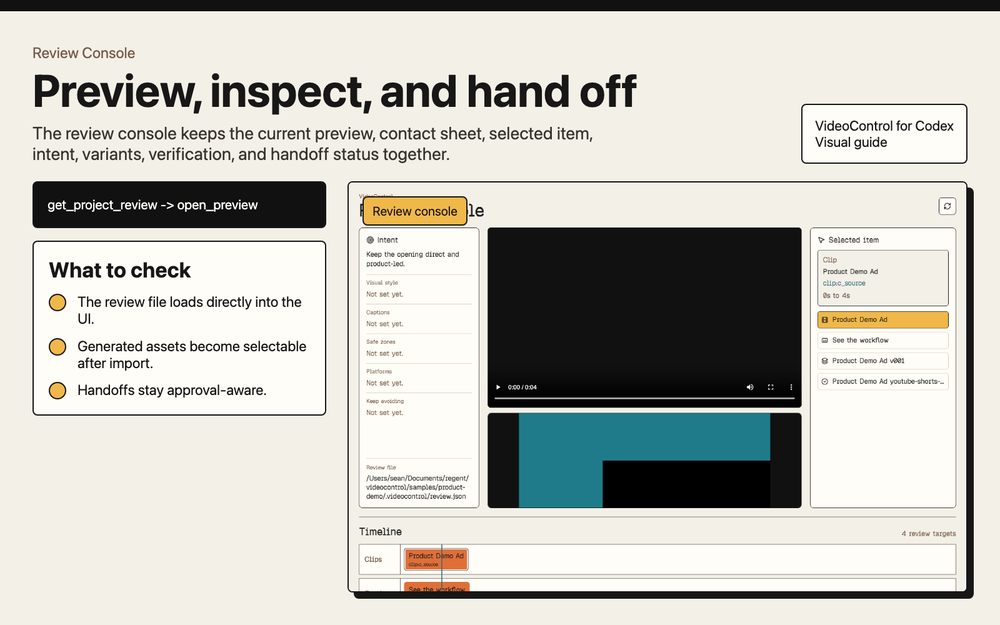
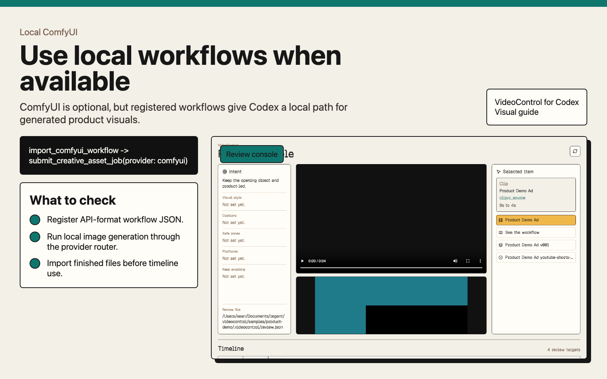

# VideoControl Visual Guide

These images show the Codex-first VideoControl flow using a generated quickstart cover and real screenshots from the local preview app.

Regenerate the guide after UI changes:

```bash
pnpm create:samples
pnpm dev:preview
mkdir -p docs/visual-guide/screenshots
'/Applications/Google Chrome.app/Contents/MacOS/Google Chrome' --headless=new --disable-gpu --hide-scrollbars --run-all-compositor-stages-before-draw --virtual-time-budget=5000 --window-size=1440,1100 --screenshot=docs/visual-guide/screenshots/product-demo-review.png 'http://127.0.0.1:48731/?review=/Users/sean/Documents/regent/videocontrol/samples/product-demo/.videocontrol/review.json'
pnpm visual:guide
```

The screenshot source is `docs/visual-guide/screenshots/product-demo-review.png`. The generated quickstart source is `docs/visual-guide/source/imagegen-quickstart-cover.png`.

## Images















